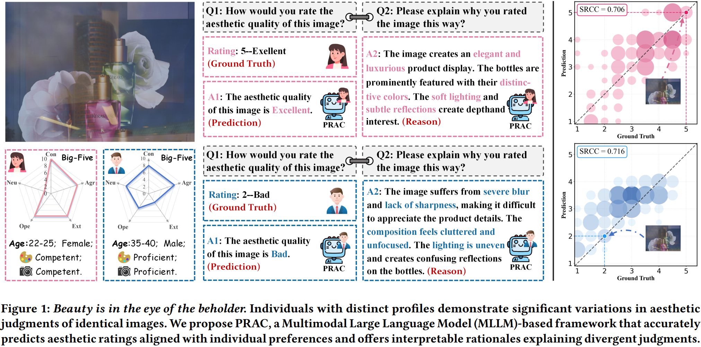

    
    
    

<h1 align="center">Personalized Image Aesthetic Assessment via Preference-rich Sample Mining and Cohort Merging</h1>

    Zhichao Yang1†,
    Tianjiao Gu1†,
    Zhixianhe Zhang1,
    Xiangfei Sheng1,
    Pengfei Chen1,
    Leida Li1,2*

  1School of Artificial Intelligence,
  2State Key Laboratory of EMIM, Xidian University

†Equal contribution &nbsp;&nbsp; *Corresponding author

 

  

    <h2 style="border-bottom: 1px solid #eaecef; padding-bottom: 0.3em; margin-bottom: 1em;">News</h2>
    <ul style="list-style-type: none; padding-left: 0;">
        <li style="margin-bottom: 0.8em;">
            <strong>[2026-07-10]</strong> 🎉🎉  Our paper, "Personalized Image Aesthetic Assessment via Preference-rich Sample Mining and Cohort Merging", has been accepted to <strong>ACMMM 2026</strong>!
        </li>
    </ul>

