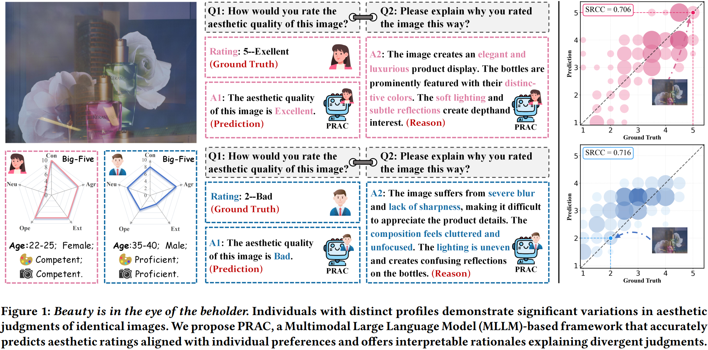

<div align="center">
    <a href="http://arxiv.org/abs/2607.15752"></a>
    <a href="https://yzc-ippl.github.io/PRAC/"></a>
    <a href='https://yzc-ippl.github.io/PRAC/stargazers'></a>
</div>

<h1 align="center">Personalized Image Aesthetic Assessment via Preference-rich Sample Mining and Cohort Merging</h1>

<div align="center">
    Zhichao Yang<sup>1†</sup>,
    Tianjiao Gu<sup>1†</sup>,
    Zhixianhe Zhang<sup>1</sup>,
    Xiangfei Sheng<sup>1</sup>,
    Pengfei Chen<sup>1</sup>,
    Leida Li<sup>1,2*</sup>
</div>

<div align="center">
  <sup>1</sup>School of Artificial Intelligence,
  <sup>2</sup>State Key Laboratory of EMIM, Xidian University
</div>

<div align="center">
<sup>†</sup>Equal contribution &nbsp;&nbsp; <sup>*</sup>Corresponding author
</div>

<br>

<div align="center">
  
</div>

<div style="font-family: sans-serif; margin-bottom: 2em;">
    <h2 style="border-bottom: 1px solid #eaecef; padding-bottom: 0.3em; margin-bottom: 1em;">News</h2>
    <ul style="list-style-type: none; padding-left: 0;">
        <li style="margin-bottom: 0.8em;">
            <strong>[2026-10-03]</strong> ✨</span>✨</span> The <strong>Code</strong> and <strong>Pre-trained Weights</strong>, are now publicly available.
        </li>
        <li style="margin-bottom: 0.8em;">
            <strong> [2026-08-28]</strong> 🎉</span>🎉</span> Congratulations! Our paper has been accepted for an <strong>Oral Presentation</strong> at ACM MM 2026.
        </li>
        <li style="margin-bottom: 0.8em;">
            <strong>[2026-07-10]</strong> 🎉</span>🎉</span>  Our paper, "Personalized Image Aesthetic Assessment via Preference-rich Sample Mining and Cohort Merging", has been accepted to <strong>ACMMM 2026</strong>!
        </li>
    </ul>
</div>

## Introduction

This release contains the PARA implementation of PRAC: the Generic Aesthetic Predictor (GIAA), PreferSelect, PreferMerge, data loaders, and experiment configurations. Run commands from the repository root.

## Quick Start

### 1. Create the environment

The following environment matches the released configuration. Install the PyTorch build that matches the CUDA runtime available to the target GPU; the example uses PyTorch 2.4.1 with CUDA 12.1.

```bash
conda create -n prac python=3.10 -y
conda activate prac
conda install pytorch==2.4.1 torchvision==0.19.1 pytorch-cuda=12.1 -c pytorch -c nvidia
pip install -r requirements.txt
```

### 2. Download the model and data

Download the [mPLUG-Owl3-7B-241101 base checkpoint](https://huggingface.co/mPLUG/mPLUG-Owl3-7B-241101) and place it at `models/mPLUG-Owl3-7B`, or set `model.model_path` in the YAML files to another compatible local path. Then you can download the pretrained adapter from [Baidu Netdisk](https://pan.baidu.com/s/1pK-BDCCJLWci0tawbfYrog?pwd=3rd3) (pwd=`3rd3`).

Obtain the PARA dataset from [this link](https://web.xidian.edu.cn/ldli/en/dataset.html) and extract the archive's directory to `data`. The loaders also need derived files. Generate them from the original annotations with:

```bash
python scripts/prepare_giaa_labels.py --source data/PARA --output data/PARA
```

The final data layout is:

```text
data/PARA/
├── README.md                                # original dataset README
├── imgs/<session_id>/<image_name>           # original images
├── annotation/                              # original PARA annotations
├── para_giaa_train_discretized.csv          # from annotation/PARA-GiaaTrain.csv
├── para_giaa_test_discretized.csv           # from annotation/PARA-GiaaTest.csv
└── ...                                      # other original PARA files
```

The personalized-data loaders read the original `annotation/PARA-Images.csv` directly. User prompts are kept in the repository at `data/user_info_para.json`; the label-generation script does not copy or modify either file.

### 3. Run the inference demo

After the base checkpoint and PARA images are available, the demo automatically scores the first image below `data/PARA/imgs`:

```bash
python demo_inference.py
```

To use a particular image, a trained adapter, or a generated rationale:

```bash
python demo_inference.py \
  --image data/PARA/imgs/<session_id>/<image_name> \
  --adapter-path runs/para/giaa_adapter \
  --explain
```

## Repository Structure

```text
.
├── configs/
│   ├── giaa_train_config/       GIAA training configuration
│   ├── giaa_eval_config/        GIAA evaluation and demo configuration
│   ├── preferselect_config/     CCM/PDM data and model configuration
│   └── prefermerge_config/      LoRA-pool, FIM, and merge configuration
├── data/                        Dataset layout and download notes
├── data_loader/                 GIAA and personalized PARA data loaders
├── modules/MplugOwl3ForGIAA.py   mPLUG-Owl3 wrapper and LoRA utilities
├── demo_inference.py            Single-image distribution and score demo
├── mplug3_train_giaaBackbone.py Train the generic aesthetic predictor
├── mplug3_eval_giaaBackbone.py  Evaluate a GIAA adapter
├── preferSelect_CCM.py          Compute collective controversy (CCM)
├── preferSelect_PDM_fast.py     Compute cached personalized deviation (PDM)
├── preferSelect_weights_ablation.py
│                                Combine CCM and PDM for all alpha values
├── preferSelect.py              Export ranked preference-rich samples
├── preferMerge.py               Train LoRA pool or run adapter merging
├── preferMerge_FIM_fixed.py     Compute FIM preference similarities
├── preferMerge_choice_fast.py   Select a relevance/diversity cohort
├── utils.py                     Shared losses, metrics, and configuration helpers
├── CITATION.cff                 Citation metadata
├── LICENSE                      MIT license for the PRAC source code
└── docs/                        Project page and reproduction guide
```

## Usage

### 1. Train and evaluate GIAA

Edit [`configs/giaa_train_config/para.yaml`](configs/giaa_train_config/para.yaml) if the model, data, batch size, or output path differs from the defaults, then run:

```bash
python mplug3_train_giaaBackbone.py
```

The trainer writes LoRA checkpoints below `runs/para/giaa`. Evaluate a selected adapter with:

```bash
python mplug3_eval_giaaBackbone.py
```

### 2. Mine preference-rich samples with PreferSelect

CCM measures the predictive standard deviation of the generic distribution. PDM measures the KL divergence between generic and user-profile-conditioned distributions.

Run the commands below:

```bash
python preferSelect_CCM.py
python preferSelect_PDM_fast.py
python preferSelect_weights_ablation.py
python preferSelect.py
```

### 3. Train the candidate user LoRA pool

Set `dataset.piaa_size` to `10-shot` or `100-shot` in both [`para_lora_pool.yaml`](configs/prefermerge_config/para_lora_pool.yaml) and [`para_test_users.yaml`](configs/prefermerge_config/para_test_users.yaml). Use a separate output path for each shot setting. Node 1 trains adapters for the candidate users and records the fixed test-user split:

```bash
PREFERMERGE_NODE=node1 python preferMerge.py
```

### 4. Build FIM preference embeddings

The FIM stage reinitializes the personalization LoRA with the fixed seed and computes target-to-candidate cosine similarities:

```bash
python preferMerge_FIM_fixed.py
```

### 5. Select an aesthetically resonant cohort

The paper uses cohort size `K=6` and relevance/diversity weight `beta=0.5`. The selection script exposes this parameter as `--beta`:

```bash
python preferMerge_choice_fast.py --top-n 6 --beta 0.5
```

### 6. Merge the cohort and personalize target users

Node 2 reads the LoRA pool, FIM matrix, cohort CSV, and target-user data, then evaluates the weighted merge and fine-tunes each target user:

```bash
PREFERMERGE_NODE=node2 python preferMerge.py
```

## Citation

If this code or paper helps your research, please cite:

```bibtex
@inproceedings{yang2026personalized,
  title={Personalized Image Aesthetic Assessment via Preference-rich Sample Mining and Cohort Merging},
  author={Yang, Zhichao and Gu, Tianjiao and Zhang, Zhixianhe and Sheng, Xiangfei and Chen, Pengfei and Li, Leida},
  booktitle={Proceedings of the 34th ACM International Conference on Multimedia},
  year={2026}
}
```

Citation metadata is also available in [`CITATION.cff`](CITATION.cff).

## License

The PRAC source code is available under the [MIT License](LICENSE).
